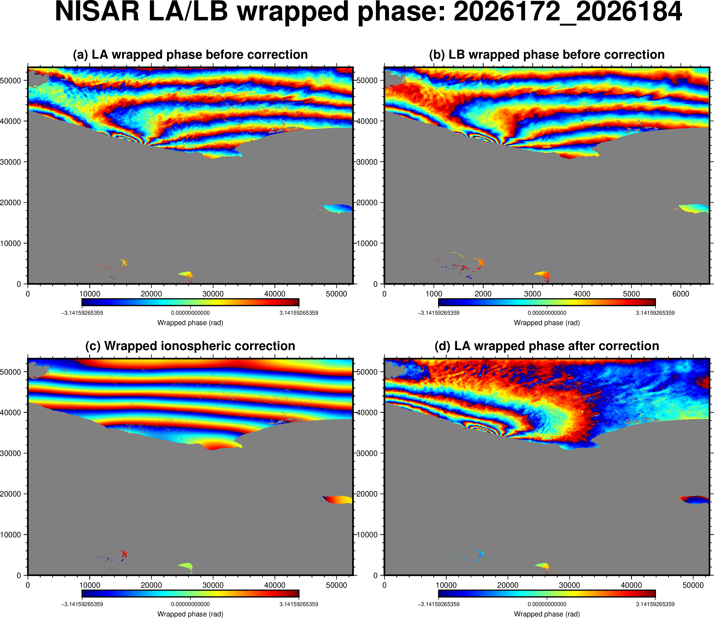
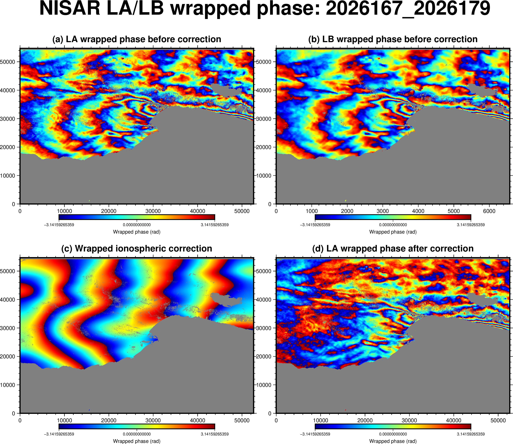

# GMTSAR-based NISAR DInSAR LA/LB workflow

Research scripts for a two-acquisition NISAR DInSAR workflow based on
[GMTSAR](https://github.com/gmtsar/gmtsar). The workflow prepares the LA and LB
frequency channels, forms interferograms, builds radar-coordinate land masks,
unwraps both channels with SNAPHU, estimates the split-spectrum ionospheric
phase, and re-unwraps the corrected LA interferogram.

> **Research status:** This repository is an experimental processing workflow,
> not an official NASA/JPL or GMTSAR product. Validate unwrapping, connected
> components, phase referencing, and ionospheric corrections for every scene.

中文说明见 [README_zh.md](README_zh.md).

## Workflow

| Step | Script | Main purpose |
| --- | --- | --- |
| 1 | `run1_get_nisar_make_dem_kml.py` | Read NISAR footprint KML files and prepare the DEM/KML products. |
| 2 | `run2_prepare_NISAR_LA_LB.sh` | Prepare LA/LB GMTSAR project directories and configuration. |
| 3 | `run3_process_NISAR_LA_LB.sh` | Run GMTSAR NISAR pair processing for LA and LB. |
| 4 | `run4_make_landmask_ra.sh` | Construct radar-coordinate land masks. |
| 5 | `run5_presnaphu_preview.sh` | Preview the masked wrapped phase and coherence before unwrapping. |
| 6 | `run6_unwrap_interp_geocode_LA_LB.sh` | Fill phase gaps, unwrap LA/LB with SNAPHU, and geocode the results. |
| 7 | `run7_nsr_iono_LA_LB.sh` | Estimate and filter the LA/LB split-spectrum ionospheric correction. |
| 8 | `run8_iono_corrected_LA.sh` | Re-unwrap the corrected LA phase and produce LOS/geographic products. |

```text
NISAR RSLC pair + orbit/footprint information
                    |
                    v
        run1: footprint and DEM preparation
                    |
                    v
        run2: LA/LB directory preparation
                    |
                    v
        run3: GMTSAR interferogram formation
                    |
                    v
        run4: radar-coordinate land masks
                    |
                    v
        run5: pre-SNAPHU quality preview
                    |
                    v
        run6: interpolation + LA/LB unwrapping
                    |
                    v
        run7: split-spectrum ionosphere estimate
                    |
                    v
        run8: corrected LA re-unwrapping + LOS
```

## Requirements

- Linux with Bash and C shell/tcsh
- GMTSAR with NISAR/NSR support
- GMT 6
- SNAPHU
- Python 3
- Python packages listed in `requirements.txt`
- NISAR RSLC input files and their footprint KML files
- A DEM accessible through the GMTSAR/GMT preparation workflow

The Python helper reproducing the GMTSAR `nearest_grid` selection behavior
requires NumPy, SciPy, and netCDF4.

## Expected project layout

Place these scripts in the root of one processing project:

```text
project/
├── raw/
│   ├── NISAR_L1_PR_RSLC_...h5
│   ├── NISAR_L1_PR_RSLC_...h5
│   └── *_NATIVE.kml
├── topo/
├── run1_get_nisar_make_dem_kml.py
├── run2_prepare_NISAR_LA_LB.sh
├── ...
└── run8_iono_corrected_LA.sh
```

The scripts create and populate `LA/`, `LB/`, `iono_correction/`, and
`LA_iono_corrected/` beneath that project directory. Large data products are
intentionally excluded from version control.

## Typical execution

Activate the GMTSAR environment first, then run each step only after inspecting
the previous step's output.

```bash
python3 run1_get_nisar_make_dem_kml.py
./run2_prepare_NISAR_LA_LB.sh
./run3_process_NISAR_LA_LB.sh
./run4_make_landmask_ra.sh
./run5_presnaphu_preview.sh 0.1
./run6_unwrap_interp_geocode_LA_LB.sh 0.1 0
./run7_nsr_iono_LA_LB.sh
./run8_iono_corrected_LA.sh 0.1 0
```

Do not continue to step 7 if step 6 contains rectangular phase jumps,
unresolved connected-component offsets, or other unwrapping errors. The Gomba
split-spectrum factor amplifies LA/LB phase-reference errors.

## Important parameters

### Run 6 interpolation radius

`NEAREST_GRID_RADIUS` is a search radius in **grid cells**, not metres. The
default is 300. A larger value may bridge wider low-coherence gaps but can also
connect physically unrelated regions.

```bash
NEAREST_GRID_RADIUS=1000 \
./run6_unwrap_interp_geocode_LA_LB.sh 0.1 0
```

Always compare `conncomp.grd`, `unwrap.grd`, and the original wrapped phase
after changing this value.

### Run 7 ionospheric filter scale

`IONO_FILTER_WAVELENGTH` is in metres. The default is 20000 m.

```bash
IONO_FILTER_WAVELENGTH=10000 \
IONO_OUTPUT_DIR="$PWD/iono_correction_10km" \
./run7_nsr_iono_LA_LB.sh
```

Use a different `IONO_OUTPUT_DIR` for tests so that an existing correction is
not overwritten.

Additional environment variables include:

- `NEAREST_GRID_PYTHON`: Python executable used by run 6.
- `IONO_PYTHON`: Python executable used by run 7.
- `IONO_CORR_THRESHOLD`: LA/LB coherence threshold used by run 7; default 0.1.
- `NISAR_PROJECT_DIR`: alternate project directory for run 7.
- `RUN8_OUTPUT_DIR`: alternate output directory for run 8.

## Main outputs

- `LA/intf/<pair>/unwrap.grd`, `LB/intf/<pair>/unwrap.grd`: step 6 unwrapped phases.
- `LA/intf/<pair>/conncomp.grd`, `LB/intf/<pair>/conncomp.grd`: SNAPHU connected components.
- `iono_correction/iono_correction_filt.grd`: filtered ionospheric correction on the LA grid.
- `iono_correction/phase_LA_after.grd`: corrected wrapped LA phase.
- `LA_iono_corrected/unwrap.grd`: final corrected and re-unwrapped LA phase.
- `LA_iono_corrected/los.grd`: final radar-coordinate LOS displacement.
- Geographic grids, PNG/KML previews, PDFs, and processing reports created by the relevant steps.

## Quality control

Before accepting a result:

1. Inspect LA and LB wrapped phase, coherence, masks, and `conncomp.grd`.
2. Reject step 6 results containing integer-cycle blocks or artificial seams.
3. Check that LA/LB unwrapped phases use compatible phase references.
4. Inspect the unwrapped ionospheric correction, not only its wrapped display.
5. Compare several physically reasonable filter scales without overwriting results.
6. Verify that the final corrected phase preserves expected deformation and does not increase obvious artifacts.

`diagnose_iono_LA_LB.sh` is included as an auxiliary diagnostic. It uses
`iono_correction/` by default and honors `NISAR_PROJECT_DIR`,
`IONO_OUTPUT_DIR`, and `IONO_DIAGNOSTIC_DIR`.

## Example results

Wrapped LA/LB phases, split-spectrum ionospheric correction, and corrected LA
phase for two example tracks:

### Track T126D



### Track T54D



## Related publication by the maintainer

Wang, X., Li, D., Zhu, J., Xu, X., Li, Z., Sandwell, D. T., Hao, D., Liu, C.,
and Fang, R. (2026). Near instantaneously triggered Mw 5.9 aftershock during
the 2025 Mw 7.1 Dingri earthquake revealed by radar interferometry. *Earth and
Planetary Science Letters*, **686**, 120070.
[https://doi.org/10.1016/j.epsl.2026.120070](https://doi.org/10.1016/j.epsl.2026.120070)

## Data policy

NISAR RSLC/HDF5 files, DEMs, GMT grids, SLCs, interferograms, logs, PDFs,
figures, KML files, and derived processing products are not part of this
source repository. Follow the applicable NISAR and DEM data-distribution terms.

## Authorship and provenance

- Split-spectrum method: Gomba et al. (2016).
- Script development: Yajun Zhang.
- NISAR LA/LB workflow update and final integration: Xin Wang, University of
  Science and Technology of China (USTC), Hefei, China.
- Processing relies on GMTSAR, GMT, and SNAPHU; cite those projects and the
  relevant NISAR products in scientific use.

## License

This repository is distributed under the GNU General Public License v3.0.
See [LICENSE](LICENSE). Third-party software and data retain their respective
licenses and distribution terms.
